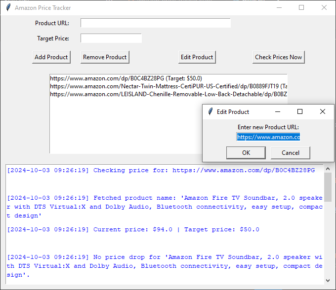

# Amazon Price Tracker

A Python-based GUI application to monitor and track prices of products on Amazon. Receive real-time email notifications when the price of your desired products drops below your target prices. Manage your product list easily with functionalities to add, remove, and edit products directly from the user-friendly interface.



## Table of Contents

- [Features](#features)
- [Demo](#demo)
- [Installation](#installation)
  - [Prerequisites](#prerequisites)
  - [Setup](#setup)
- [Configuration](#configuration)
- [Usage](#usage)
  - [Adding a Product](#adding-a-product)
  - [Removing a Product](#removing-a-product)
  - [Editing a Product](#editing-a-product)
  - [Viewing Logs](#viewing-logs)
  - [Manual Price Check](#manual-price-check)
- [Troubleshooting](#troubleshooting)
- [Contributing](#contributing)
- [Contact](#contact)

## Features

- **Add Products:** Easily add Amazon product URLs along with your target prices.
- **Remove Products:** Remove products from your tracking list with a single click.
- **Edit Products:** Modify the URL or target price of existing products.
- **Real-Time Notifications:** Receive email alerts when product prices drop below your set targets.
- **Shortened URLs:** Display cleaner, shortened Amazon URLs to reduce clutter in the interface.
- **Responsive GUI:** Intuitive and user-friendly interface built with `tkinter`.
- **Background Price Checking:** Automatically check prices at scheduled intervals without freezing the GUI.

## Demo


## Installation

### Prerequisites

- **Python 3.6 or higher**: Ensure you have Python installed. You can download it from [python.org](https://www.python.org/downloads/).
- **Git**: For cloning the repository. Download from [git-scm.com](https://git-scm.com/downloads).

### Setup

1. **Clone the Repository**

   ```bash
   git clone git@github.com:edin2pies/amazon-price-notify.git
   cd amazon-price-notify
   ```

2. **Create a Virtual Environment (Optional but Recommended)**

    ```bash
    python -m venv venv
    source venv/bin/activate  # On Windows: venv\Scripts\activate
    ```

3. **Install Dependencies**

    Ensure you have pip installed, then run:
    ```bash
    pip install -r requirements.txt
    ```

### Configurations

1. **Create config.py**

    The application requires a config.py file to store your email credentials securely. Create a config.py in the project root directory with the following content:

    ```bash
    EMAIL_ADDRESS = 'your_email@example.com'
    EMAIL_PASSWORD = 'your_email_password'
    SMTP_SERVER = 'smtp.gmail.com'
    SMTP_PORT = 587
    ```

    **Important**

    If you're using Gmail, you might need to enable App Passwords and use the generated app password instead of your regular email password for enhanced security.
    Never commit your config.py to version control. Ensure it's added to .gitignore.

2. **Add config.py to .gitignore**

    To prevent accidental commits of sensitive information, add config.py to your .gitignore file:
    ```bash
    # .gitignore
    config.py
    ```

### Usage

1. **Run the Application**

    ```bash
    python main.py
    ```

2. **Using the GUI**
    
    - Add a Product
        - Enter the Amazon product URL in the "Product URL" field.
        - Enter your target price in the "Target Price" field.
        - Click "Add Product".
        - The product will appear in the list with a shortened URL, and a log message will confirm the addition.
    
    - Remove a Product
        - Select the product from the list.
        - Click "Remove Product".
        - The product will be removed from the list, and a log message will confirm the removal.

    - Edit a Product
        - Select the product from the list.
        - Click "Edit Product".
        - A dialog will appear allowing you to modify the URL and/or target price.
        - After editing, the list and logs will update accordingly.

    - View Logs
        - The log area displays informational messages, successes (e.g., emails sent), and errors in color-coded formats for easy monitoring.

    - Manual Price Check
        - Click "Check Prices Now" to manually trigger a price check for all tracked products.
        - Logs will display the status of each product check and any email notifications sent.

### Troubleshooting

1. Failed to Send Email
    - Cause: Incorrect SMTP settings or invalid email credentials.
    - Solution: Double-check your config.py for correct email address, password, SMTP server, and port. If using Gmail, ensure App Passwords are set up correctly.

## Contributing

Feel free to fork the project, make improvements, and submit pull requests.